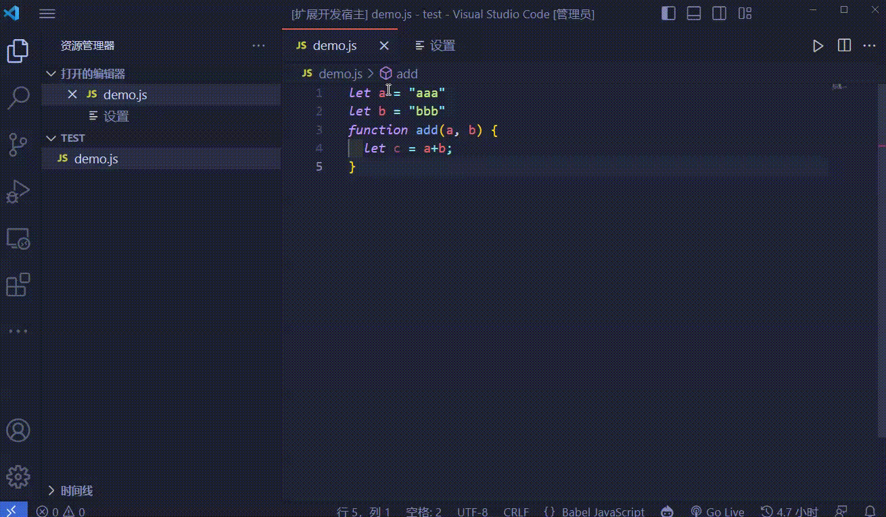
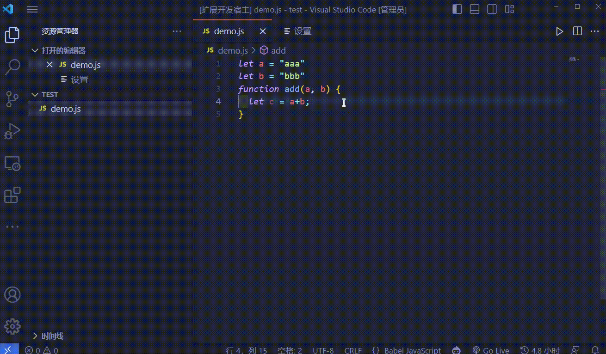
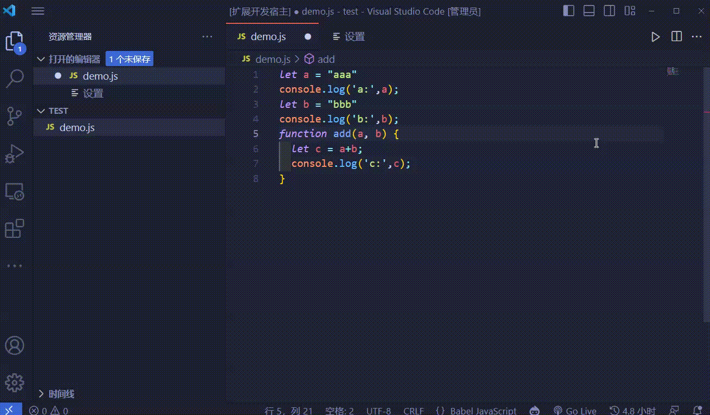
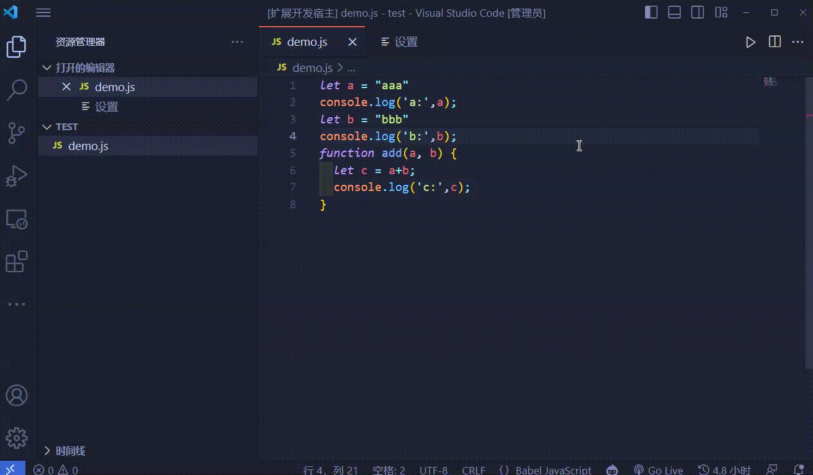

# 🚀 Log Master - VS Code Extension

让日志打印更加轻松的 VS Code 扩展！🎉🎉🎉

该扩展允许您通过快捷键快速插入日志语句，并提供日志语句头部的自定义配置，支持通过命令行快速删除或注释当前文件的所有日志。

## ✨ 特点

- **快捷键插入**：使用预设的快捷键快速插入 `console.log` 语句。
- **日志头部配置**：可以自定义日志的前缀，包括时间、自定义字符串和数据类型。
- **日志管理**：通过命令行快速清理或注释当前文件的所有日志。

## 📥 安装

该扩展可在 VS Code 插件市场中找到。搜索 `Log Master` 并点击安装即可。

## 🔨 使用说明

### 快速插入日志说明

1. 框选您想要打印的字符(可以使用`alt`多选)。
2. 使用快捷键 `Ctrl+Shift+C` (Windows) 或 `Cmd+Shift+C` (Mac)。
3. 一个 `console.log` 语句会插入到您的代码中。

### 配置日志头部说明

1. 前往 `文件` > `首选项` > `设置`。
2. 搜索 `LogMaster` 设置。
3. 在此处，你可以配置时间戳、自定义字符串和数据类型。

### 删除日志说明

在命令面板 (`Ctrl+Shift+P` 或 `Cmd+Shift+P`) 中输入 `Remove All Logs` 并执行。

### 注释日志说明

在命令面板 (`Ctrl+Shift+P` 或 `Cmd+Shift+P`) 中输入 `Comment All Logs` 并执行。

## 🛠️ 配置

以下是可用的配置选项列表：
- `logHelper.quoteStyle`: 设置日志的引号类型(单双引号)。
- `logHelper.includeTime`: 设置是否在日志前缀中包含时间。
- `logHelper.customEmoji`: 设置自定义前缀字符串(可以输入表情)。
- `logHelper.includeType`: 设置是否在日志前缀中包含数据类型。

_更多配置选项将在后续版本中提供。敬请期待！_

## 🐛 已知问题

目前没有已知问题。如果您发现任何问题，请通过下面的联系方式告诉我！

## 🆕 贡献

寻找您的反馈和建议！如果您有新的需求或者发现了 bug，请不要犹豫，通过 [17681081091@163.com](mailto:17681081091@163.com) 联系我。

## 📋 许可证

[让我研究一下]

---

感谢您使用 LogMaster 扩展！如果您觉得这个扩展有用，请给它一个星标。🌟

🎊🎊
## 🧸 版本说明

> 2023/12/20 —————— 发布
 
    预祝圣诞快乐
